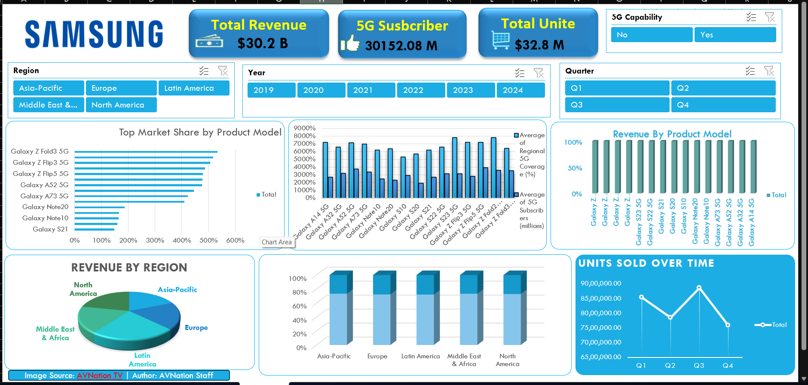

Samsung Sales Dashboard - GitHub README
Project Overview
This Power BI dashboard project provides an interactive analysis of Samsung smartphone sales, market share, revenue, subscribers, and regional performance. The dashboard helps users track product performance, 5G adoption, revenue growth, and sales trends across multiple regions.
Dashboard Features
•	Interactive filters for Region, Year, Quarter, and 5G Capability

•	Total Revenue, Subscribers, and Units Sold KPI cards

•	Revenue analysis by product model

•	Market share comparison across Samsung devices

•	Regional revenue insights

•	Quarterly units sold trend analysis

•	5G subscriber and coverage analytics

Tools & Technologies

•	Power BI Desktop

•	Data Visualization

•	Dashboard Design

•	DAX Measures

•	Data Modeling

Dashboard Preview
 
Key Insights
•	Galaxy Fold and Flip models contribute significantly to market share.

•	Asia-Pacific and Europe generate strong revenue performance.

•	Q3 shows the highest units sold compared to other quarters.

•	5G-enabled models demonstrate strong subscriber growth.

Dashboard Screenshot

See on Linkedin :- https://www.linkedin.com/posts/uday-kakad-045976322_excel-dashboard-dataanalytics-activity-7459969230017470464-vjb1?utm_source=share&utm_medium=member_desktop&rcm=ACoAAFGoK7UBdOtGb27rS8_rCE-uogb9uftbs7A

GitHub README Description

Developed an interactive Samsung Sales Dashboard in Power BI to analyze revenue, market share, 5G subscribers, and regional sales performance. The dashboard includes dynamic filters, KPI cards, trend analysis, and product-level insights to support business decision-making.

Created for GitHub Portfolio Presentation
